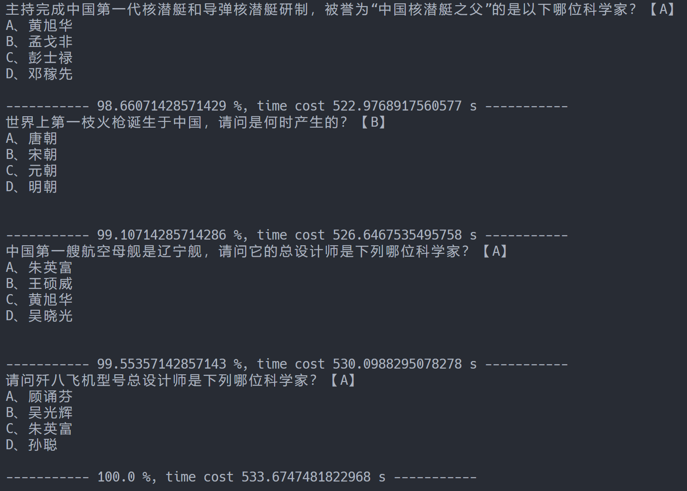

# PPTX Generator

## Why


## Usage
```zsh
# Ubuntu
$> pip install python-pptx
$> python3 ./pptx-generator.py
```

## Output
### Command Line


### PowerPoint file


## Reference
- [Accessing the text frame](https://python-pptx.readthedocs.io/en/latest/user/text.html#accessing-paragraphs)
- [Python pptx - part of text in cell with different color](https://stackoverflow.com/questions/59032019/python-pptx-part-of-text-in-cell-with-different-color)
