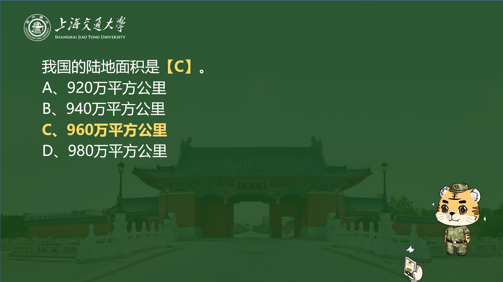

# PPTX Generator

## Why

在制作[军事知识竞赛的Slide](./question.pptx)时，需要导入200+题的[题库](./question.md)，并且题目的答案需要**按照特定格式（加粗、变色）处理**。人工制作耗时太长，于是考虑使用`python-pptx`package进行自动化处理。

最终实现的效果为：

- 每道题目有一页slide显示题目，下一页slide显示答案。
- 答案加粗并变色显示。如果题目为选择题（多选 or 单选），那么所有正确选项也按相同格式加粗变色。


## Usage
```zsh
# Ubuntu
$> pip install python-pptx
$> python3 ./pptx-generator.py
```

## Output
### Command Line Output

- 命令行输出时显示**导入的百分比和总耗时**。


### Slide File Output

- 题目页


- 答案页


## Reference
- [Accessing the text frame](https://python-pptx.readthedocs.io/en/latest/user/text.html#accessing-paragraphs)
- [Python pptx - part of text in cell with different color](https://stackoverflow.com/questions/59032019/python-pptx-part-of-text-in-cell-with-different-color)
